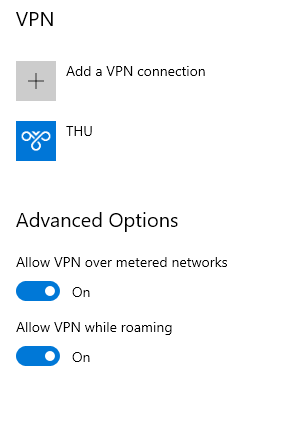
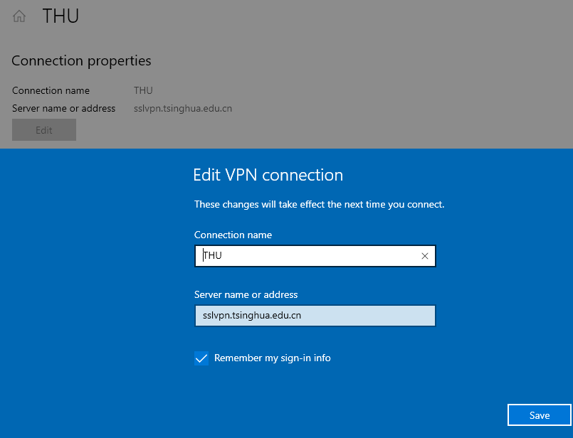

#### Learn Helper更懂你的网络学堂助手
自动化网络学堂的工作，节省每次用浏览器上网络学堂的时间。

采用 React 框架开发，并配合 Material-UI，在保留原有布局和操作习惯的同时，尽量遵循 material 的设计风格。下面是一张使用截图，UI一共分为三栏：左侧为功能栏，用于切换内容/课程，并带有未读计数，也有附加的设置；中间为卡片栏，聚合所有选择的内容，并以卡片的方式呈现重要信息，按照重要程度排序。最右侧是详情栏，可以显示被点击卡片的详细信息（如公告内容、作业提交链接等）。

##### Features: 
* 作业自动按照 DDL 排序并有不同颜色代表紧急程度（蓝、黄、橙、红、黑-过期）
* 支持对卡片进行置顶（加星标）和切换已读/未读状态
* 支持忽略某些课程（实验室科研探究）的一些内容以防刷屏
* 支持对卡片进行过滤，再也不用一路翻找了
* 在 Chrome 插件栏上加上未读数量的角标，激起强迫症患者的阅读欲

##### Links: 
* Website: 微信号: thu-learn-helper
* Available at Chrome Web Store: https://chrome.google.com/webstore/detail/learn-helper/mdehapphdlihjjgkhmoiknmnhcjpjall
* Source Repo: https://github.com/xxr3376/Learn-Project

##### Links for reference:
* 旧版本: 
    * http://zhan.renren.com/amazingstore
* thu-learn-lib是一个获取网络学堂信息的工具库:  
    * https://github.com/Harry-Chen/thu-learn-lib
    * https://www.npmjs.com/package/thu-learn-lib

#### 校外通过SSLVPN连校内
如果你用Windows 10的话，不建议使用 [清华信息化服务平台](https://its.tsinghua.edu.cn)上面下载的需要另行安装的.exe，而是建议在Windows应用商店里找到[Pulse Secure](https://www.microsoft.com/en-us/p/pulse-secure/9nblggh3b0bp)。这样做的好处一个是简洁稳定，另一个是可以用PowerShell等方式自动化。



#### 清华大学网络IP地址段
由SSLVPN的配置文件中获得
```
59.66.0.0/16
101.5.0.0/16
101.6.0.0/16
118.229.0.0/19
166.111.0.0/16
172.17.0.0/16
172.18.0.0/16
183.172.0.0/15
202.112.39.2/32
219.223.168.0/21
219.223.176.0/20
```

