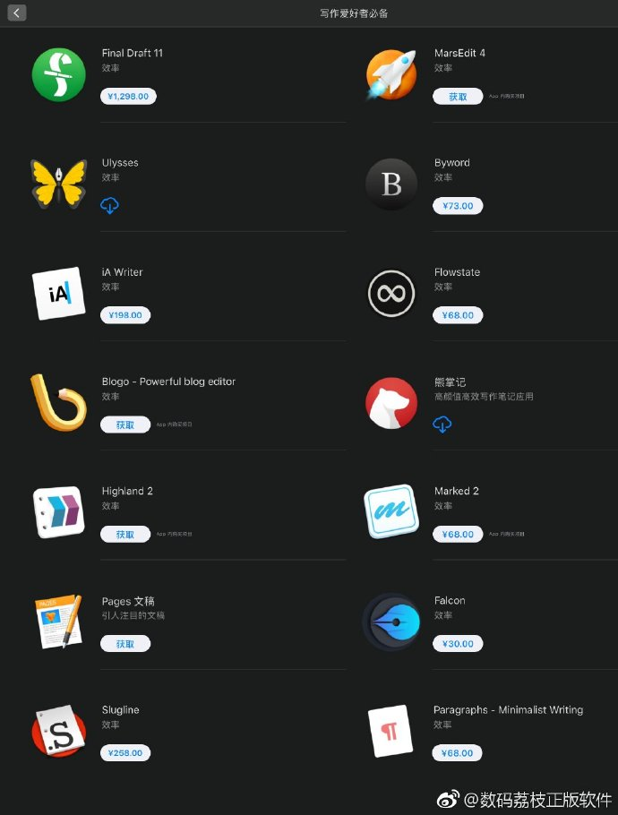

## Know-how

#### How I organize my knowledge as a Software Engineer
https://dev.to/brpaz/how-do-i-organize-my-knowledge-as-a-software-engineer-4387 

## Aggregation Tool

#### Station: One app to rule them all
A very powerful  smart browser for busy people. A single place for all of your web applications. It also keeps you stay focused. It even allows you to run multiple accounts. 
* Aggregates Google Drive, Gmail, Google Calendar, Evernote, Trello, Slack, Dropbox...etc. Almost anything that supports google account and more
* https://getstation.com/

## Knowledge Base  / Wiki

#### Lark: Collaboration & Communication Software
* Includes: Integrated Messenger (chat), Productive Conferences (meeting), Calendar 
https://www.larksuite.com/

#### 语雀：云端知识库
https://www.yuque.com/

#### Outline
A modern team knowledge base for your internal documentation, product specs, support answers, meeting notes, onboarding, 
https://www.getoutline.com/

#### TiddlyWiki
A __non-linear__ notebook for capturing, organising and sharing complex information.
https://tiddlywiki.com/

## Note-taking tools
* [Notion](https://www.notion.so/) `Notion=Google docs+Evernote+Trello+confluence+Githubwiki+Quip`. a note-taking application with markdown support that also integrates TBD, task management(like Trello), wiki, and CRM. The aim is to be an all-in-one workspace for note-taking, project management and task management.  It supports multiple types of embedding. 
* [LiquidText](https://www.liquidtext.net/)  academical note taking tool
* [Gitbook](https://www.gitbook.com/)
* [VuePress](https://vuepress.vuejs.org/). 
* [Joplin](https://joplinapp.org/) a free, open source note taking and to-do application, which can handle a large number of notes organised into notebooks. The notes are searchable, can be copied, tagged and modified either from the applications directly or from your own text editor. The notes are in Markdown format.
* [Notejoy](https://notejoy.com/)
* [Trilium Notes](https://github.com/zadam/trilium) is a Node-based hierarchical note taking application with focus on building large personal knowledge bases
* [Pocket](https://getpocket.com/) as read-it-later list
* [Snippet Store](https://github.com/ZeroX-DG/SnippetStore) is a snippet management tool. It's both a standalone binary and a plugin for VS Code. It supports various kinds of programming languages. Its alternatives include: 
    * Snippets feature shipped in editors / IDEs 
    * GitHub Gists
    * [BoostNote](https://boostnote.io/)
    * [Cacher](https://www.cacher.io/)    (downside: costly)
* [DevHints](https://devhints.io/) for cheat sheet management
    * [Cheatography](https://cheatography.com/) contains Markdown-formatted cheatsheets
* [Diigo](https://www.diigo.com/index) for website highlights and annotations
* [MarginNote](https://www.marginnote.com/) An in-depth PDF and EPUB reading, learning, managing and note taking
* [VSCode Notebook](https://github.com/aviaryan/VSCodeNotebook) Taking notes with VSCode
* [Dash](https://kapeli.com/dash) API Documentation Browser and Code Snippet Manager, Dash stores snippets of code and instantly searches offline documentation sets for 200+ APIs, 100+ cheat sheets and more. for Mac and iOS only
* [Zeal](https://zealdocs.org/) an offline documentation browser for software developers. It takes specified software documentation as input and aggregates them into a [single docset](https://kapeli.com/docsets), generates an index, and then you can use it as a one-stop search site. Available at [here](https://zealdocs.org/download.html)

## Tagging / Sorting 
#### Taglyst
Automated tagging
* http://www.taglyst.com/

## Writing Tools

### Other writing tools

#### Grammarly
An online grammar checking, spell checking, and plagiarism detection platform
* https://www.grammarly.com/

#### 小恐龙公文排版助手 for Word
一个Word的插件。能根据《党政机关公文格式国家标准》(GB/T 9704—2012)的格式要求，快速设置页面版式、快速设置常用文字格式、插入常用符号、版记、公文页码。支持对文字的快速排版，中文首行缩进2字符、删除空白，断句重排等。
* https://www.appinn.com/xiaokonglong-gongwen-zhushou/

## Drawing & Design Tools 
* [Sketch](https://www.sketchapp.com/)
   * [Lunacy](https://icons8.com/lunacy) 
      - A Sketch alternative for Windows 
   - Video Tutorial Installing Sketech on top of VM on top of Windows : [watch](https://www.youtube.com/watch?v=YmqtE8jzDlQ)
* Draw.io
   * Desktop: https://www.draw.io/
   * Online Live: https://about.draw.io/integrations/#integrations_offline
* [Canvas](https://www.canva.com)
   - 提供了6万套成熟、精美的设计模板，包括海报、邀请函、名片、演示文稿等等，几乎涵盖了每一个用户和生产力场景。，全部素材都可以免费使用，视觉中国和汉仪为其提供图片和字体版权支撑，可以安心使用的“真免费”设计工具。
* [Avocode](https://avocode.com/) 
    - Open designs without design tools. Export images without preparing layers. Click on layers to get code.
* [Figma](https://www.figma.com/)
* Pencil
   * Desktop: https://pencil.evolus.vn/  
   

### Process / Workflow / UML Diagram Tools
#### ProcessOn
在线协作作图 支持流程图、思维导图、原型图、UML、网络拓扑图、组织结构图
https://www.processon.com/

#### PlantUML
Easily create beautiful UML Diagrams from simple textual description
http://www.plantuml.com/plantuml/
https://plantuml.com/download

* [yEd](https://www.yworks.com/products/yed)
   * Desktop: https://www.yworks.com/products/yed
   * Online Live: https://www.yworks.com/products/yed-live
* Dia
   * Desktop: http://dia-installer.de/ 
* Inkscape   
   * Desktop: https://inkscape.org/
* Whimsical
   * Online Live: https://whimsical.co/   
* 迅捷画图
   * Online Live: https://www.liuchengtu.com/
* Visual Paradigm Online
   * Online Live: https://online.visual-paradigm.com   
* Creately
   * Online Live: https://creately.com/
* websequencediagrams
   * 在线画时序图
   * Online Live: https://www.websequencediagrams.com/
* [Graphviz](https://www.graphviz.org/)
   * Desktop (Win, Mac, Ubuntu, Fedora, etc.) https://www.graphviz.org/download/
   - An open source graph visualization software representing structural information as diagrams of abstract graphs and networks. It has important applications in networking, bioinformatics,  software engineering, and other technical domains

#### Cloud Maker
Cloud Maker helps you rapidly draw beautiful, standardised cloud architecture diagrams. '
画云端架构图
https://cloudmaker.ai/

#### Penrose 
create beautiful math diagrams just by typing mathematical notation (DSL etc) in plain text
https://github.com/penrose/penrose
http://penrose.ink/siggraph20.html

#### Nototo 
Nototo allows you to customize your note world with objects like trees, flowers, lighthouses, and many more! It's a map-style note visualization tool. It accepts OneNote as input. 
https://www.nototo.app/

### MindMap Tools

| Tool Name      | Description | URL                        |
|----------------|-------------|----------------------------|
| XMind: ZEN | commercial software | https://www.xmind.net/zen/ |
| 百度脑图        |             | http://naotu.baidu.com     | 
| 幕布      | 大纲笔记与思维导图 | https://mubu.com/  | 
| ZhiMap | | http://zhimap.com/ | 
| 凹脑图 | | https://aonaotu.com/ | 
| MindMaster | | https://mm.edrawsoft.cn |
| ProcessOn |  | https://www.processon.com/ |
| GitMind | Web-based, 支持钉钉、微信账号捆绑 | app.gitmind.cn |
| Freeplane      |             | https://www.freeplane.org/ |
| Tanguage 脑洞搜索引擎 ｜ 标签式的思维管家 | http://www.taguage.com/ |
| Coggle         |             | https://coggle.it          |   
| Heimer         | Qt-based    | https://github.com/juzzlin/Heimer |
| FreeMind       | Java-based  | https://sourceforge.net/projects/freemind/ |
| View Your Mind |             | www.insilmaril.de/vym      |

### Online IDE
#### REPL
free, collaborative, in-browser IDE to code in 50+ languages
https://repl.it/

### Office-like Tools  
* 石墨文档
* [AirTable](https://airtable.com/) a spreadsheet-database hybrid, with the features of a database but applied to a spreadsheet.
   * [Smartsheet](https://www.smartsheet.com/) 

#### 一起写
https://yiqixie.com/

#### 超级表格
excel-like tools
http://www.chaojibiaoge.com/

#### 97格格
在线报表，云问卷
https://www.97gg.com/

## Productivity Tools

### GTD Tools 
* [TickTick 滴答清单](https://ticktick.com) task management for Android, iPhone, iPad,  Mac,  Windows,  Chrome, Firefox, Android Wear,  Apple Watch
* [OmniPlan](https://www.omnigroup.com/omniplan/)
* [OmniFocus](https://www.omnigroup.com/omnifocus/) task management for Mac, iPad, and iPhone - The Omni ...

### Personal Finance 
* ~~__HomeBank__ (deprecated)
   * Github: https://github.com/timonier/homebank
   
### File Sharing / File Hosting tools
#### BitSend
https://bitsend.jp/?setLang=en

#### UploadOne
https://upl.one/

#### Zippy Share
https://www.zippyshare.com/
   
### Web Bookmark Tools

#### Notado
A content-first approach to online bookmarking. it focus around selections of text, which are fully searchable and can be organised however makes sense to you with a powerful automatic tagging system.
* https://notado.app/

#### 云收藏
* http://favorites.ren/
* https://github.com/cloudfavorites/favorites-web

#### Pinboard 
#### Instapaper
#### Readwise

### Uncategorized

