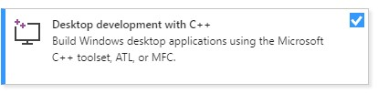
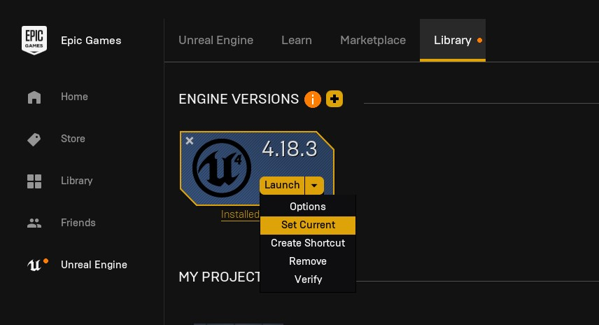
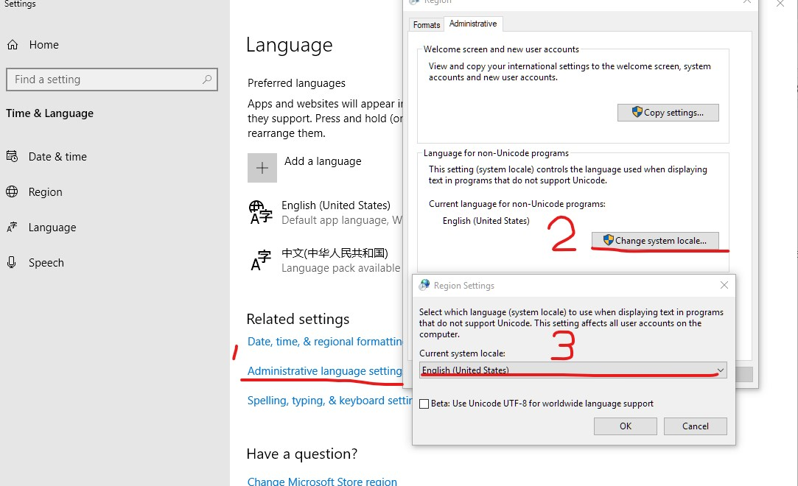

## 在Windows环境上安装Airsim和Unreal环境

### 1. 安装Visual Studio Community (2017)

去 https://visualstudio.microsoft.com/downloads/ 上面下载免费的Visual Studio Community，并且安装之。注意这是Visual Studio，不是Visual Studio Code。

注意：
1. 记得把Windows SDK要装上。Airsim指定是8.1版，为了稳妥起见勾上“Windows 8.1 SDK and UCRT SDK”，可能还需要勾上“Windows 10 SDK”。
1. 记得把“Development with C++”给勾上

安装需要下载好几个G的文件并解压，这时候可以去做别的事。

### 2. 下载安装Unreal

去 https://www.unrealengine.com/download 下载Epic Game Launcher。点左侧的“Unreal Engine”，再点右侧的“Library”。由于AirSim指定了**4.18.3**版，我们就用这个版本。点击这个版本之后就会启动相应的下载+安装流程。安装需要下载好几个G的文件并解压，这时候可以去做别的事。

注意：
1. 安装完了之后在这个界面 点击4.18引擎，并且选“Set Current”

### 3. 构建AirSim

1. 首先，**一定一定要把Windows系统的语言给改成“English - United States”**，因为任何别的语言都会导致Windows SDK的UCRT的编译出错

1. 开始菜单，点击“x64 Native Tools Command Prompt for VS 2017”，

    2.1. 最好是右键之，并点击“以管理员方式运行”
    
1. 进入一个硬盘空间宽裕的目录，运行`git clone https://github.com/Microsoft/AirSim.git`

1. （可做可不做）如果你有代码洁癖，你可以用[这个工具](https://github.com/x1angli/convert2utf/)或别的工具把git已经下载到本地的文件的编码强制改成UTF-8，以确保编码一致性。比如下面的文件：
    
        AirSim/AirLib/include/common/Settings.hpp
        AirSim/MavLinkCom/mavlink/mavlink_sha256.h 

1. 如果你在大陆的上网环境，请打开科学上网方案；否则会卡壳。

1. 等待git下载完毕后，执行如下命令
    
        cd AirSim
        build.cmd
    

### 4. 构建一个Unreal下的工程

最后，需要为小车建立一个Unreal下的工程。AirSim有一个自带的“Blocks”工程，这是为了学习用所搭建的最小化的工程；当然还有一些其他的工程，感兴趣的可以见 [这里](https://github.com/Microsoft/AirSim/releases)

1. 在`AirSim\Unreal\Environments\Blocks`目录下，执行`update_from_git.bat`. 完了会生成一个.sln文件

1. 在Visual Studio 2017中打开那个Blocks目录下新生成的.sln文件

1. 确定“Blocks”工程是“startup project”, 并且“build configuration”设置成了“DebugGame_Editor”与“Win64”. 按下F5键.

1. 在Unreal Editor中，按下“Play”按钮，就能操控小车了

