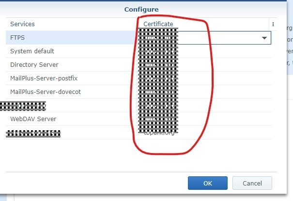

# Troubleshooting Case: Installing SSL certificates on Synology
# 故障排除实战案例: 在群晖上安装SSL证书

### 0. 目标 ###
由于Synology（群晖）的系统在多处需要使用SSL证书，比如其自身的5001管理员HTTPS界面，或者443的网站界面，或者WebDAV等……DSM系统在出厂时内置一份由Synology公司颁布的证书，但是这个证书与机器的域名不匹配，所以不建议使用，故而需要自己重新申请一个。我们这次的目标是已经通过yourdomain.name生成一个key和对应的csr，并且通过API提交到letsencrypt.com上，请求一个证书，并且把这个证书部署到群晖上。

“不就是申请和部署一个证书嘛！”听起来很简单，是不？

然而，真正撸起袖子干起来，才体会到这其中困难重重，一个坑接一个坑。一共花了将近一整天的时间才最终搞定。为了纪念逝去的时间，现将钻研过程中遇到的心得分享于此。

本文适用于群晖Synology 6.x（含山寨群晖）的用户。尤其适合80端口无法开放，以及客户端是Windows系列的系统管理员们。

### 1. 起因 ###
公司的网管已经在防火墙上禁了File Sharing / SMB 的端口，导致在公司以外就无法访问文件共享，因而只得通过在群晖上安装并启用WebDAV方式的文件共享。群晖的共享很好地与WebDAV集成，因此在群晖的共享文件夹上启用WebDAV并不复杂，但是随之而来带来又一个问题：在Windows上没有WebDAV的客户端————要么用第三方付费的软件，要么用Windows的网络映射（Map network drive），但是后者需要强制使用HTTPS。总之，部署证书的目的：
* 为了直接在Windows客户端上访问通过WebDAV共享出来的文件
* 为了以后的443端口的HTTPS网站
* 为了管理界面登录时浏览器状态栏不显示红字（强迫症，呵呵）

### 2. 预热 ###
起初在公司以外发现无法访问公司群晖上HTTP WEB网站，还以为是系统的设置问题————于是花了很多时间在设置的排查上：
* 先是看群晖自己是不是防火墙，后来发现群晖DSM没有防火墙；
* 接着又以为是nginx的什么设置出错了，导致80端口没有设置正常，于是去把WebStation包卸载又重装，但是80端口依旧无法访问；又把apache 2.2和2.4给装上，故障照旧。
* 无法telnet 80端口，说明肯定是连接断了，而不是应用层的内部错误；
* 让同事在公司内部访问HTTP网站，成功；
* 联系了公司的网管，他让笔者把一些操作重复做了N遍，以反复确认……

折腾至此，得到的结论是:
1. 80和443的TCP端口被封了，不是公司网管封的，而是ISP（市级联通）把WEB的默认端口给封了，需要另行向ISP申请才能开通
2. 公司网管把SMB文件共享的端口给封了，不值得打单独开放的申请报告；还是老老实实用WebDAV比较好，虽然WebDAV有各种问题

### 3. 过程 ###
有多种方式可以给群晖的DSM装上证书，但是大部分是死胡同或过于麻烦不值得，最终只摸索出了一条途径……

1. **使用群晖DSM自带的证书模块——失败**
   这是最简单最直接的方式，比如[这里](https://miketabor.com/install-a-lets-encrypt-ssl-on-a-synology-nas/)、[这里](https://synoguide.com/2016/04/14/secure-your-synology-with-https-ssl-certificate-from-lets-encrypt/)。其原理是在DSM操作系统中集成了一个类似[certbot](https://certbot.eff.org/)那样的客户端，然后通过http challenge或dns challenge验证域名的所有权。这里的关键是80端口已经被封上，因而无法使用http challenge；群晖DSM自带的模块又不支持DNS验证。所以就会返回类似“web服务器无法访问”的错误信息
2. **ssh登录群晖Linux上，安装certbot——失败**
   由于群晖的DSM是底层的linux，外面套了一层GUI而已，而群晖的Web Station上又有nginx、apache等web服务器，于是考虑是否可以用ssh登录到底层的linux的cli，然后在安装certbot。但是发现这个linux的定制化太偏门，既不是RHEL系的，也不是Debian系的，也不是Gentoo系的，导致没有任意一个可行的包管理器。即使不用certbot而是使用.sh脚本的客户端，也还是总有这样那样的包依赖无法满足，遂作罢。
3. **在客户端本地生成key和csr，并且手动验证——失败**
   由于笔者用的Win的客户端（欢迎鄙视），无法使用稳定且文档丰富的certbot，于是
   1. 下载了一个[Certify SSL Manager](https://certifytheweb.com/)， 装上， 先是琢磨了很多时间，发现对多个域名的支持不够好，于是只留一个“*.yourdomain.name”，接着虽然生成了证书文件，但是软件的证书文件是一个，而群晖DSM的导入界面却需要两个文件：一个含私钥的.key，另一个是证书链。试着用openssl作格式转换和文件分割，然后一直格式出错，遂放弃……
   2. 试着在MinGW上用一些其他的轻量级的基于.sh的客户端，无果——依然是同样的原因，需要下载这样或那样的linux包依赖
4. **在客户端使用pip方式安装certbot——成功**
   客户端已经完整的python，于是用`pip install certbot`一次性成功安装certbot（比较amaze的一点是在pip下能成功安装一个cli直接执行的命令）。安装虽然顺利，但是部署过程依然又是小曲折：
   1. 需要运行`certbot certonly --manual -d yourdoman.name -d www.yourdoman.name --preferred-challenges "dns"`
   2. 在执行的过程中，certbot会让你在域名记录上增加几条TXT记录，这时候你虽然增加了，最好再喝杯水，等上个个把分钟，等更新后的DNS的记录充分扩散了之后，再按下最终的回车
   3. 按下回车后，会在certbot的目录下生成一些文件，其中有用的只有两个，一个是私钥key，另一个是证书链，把这两个文件放在一个单独的文件夹上
   4. 在浏览器里登录群晖管理web界面 -> Control Panel -> Security -> Certificate 这里，单纯把新的证书给Add上

### 4. 后记 ###
1. 在通过WebDAV往群晖上面上传文件时，经常会出现某个文件出错的情况，这时候需要把文件改名，再上传，再通过web管理员界面登录进行调整。不知道这是不是Windows或者Win 7的问题，还是群晖WebDAV服务的问题，总之这个问题存在，而且还时不时遇到。
2. 在 管理web界面 -> Control Panel -> Security -> Certificate 这里，单纯把新的证书给Add上并且设置为Default还不够，还需要按下“Configure”按钮，见下图：
   
3. 虽然管理的web界面已经配置并关联了证书，但是客户端浏览器在访问的时候还是需要隔一段时间才会不显示红色（有可能是隔天），这个大概是chrome浏览器的设置

### 5. 后记的后记 ###
由于通过let's encrypt申请的免费证书只有3个月，最好设置成自动renew证书，而这种方式则依赖于群晖DSM自带的Let's Encrypt证书的自动更新模块，进而依赖于80端口的开放，故而做好开通80端口的规划。可以用群晖的“控制面板 / 任务计划 / 新增 / 计划的任务 / 用户自定义的脚本”

### 6. 后记^3

看到另外有人用acme的协议做了一套.sh脚本。
acme默认通过在DNS记录中加入信息的方式验证，这样更适合在80端口被封或者是多级子网内的群晖。这一点与前面certbot用DNS challenge的原因类似。

* [攻略](http://www.up4dev.com/2018/05/29/synology-ssl-wildcard-cert-update/)
* 原repo：[Neilpang的Github](https://github.com/Neilpang/acme.sh/tree/master/dnsapi)
* 衍生repo：[andyzhshg的Github](https://github.com/andyzhshg/syno-acme)
* 参考[群晖 Let's Encrypt 证书的自动更新](http://www.up4dev.com/2017/09/11/synology-ssl-cert-update/)

此外，Traefik是一个把端口映射到二级域名的具备服务发现机制的动态路由，会自动自动申请微服务的HTTPS证书
