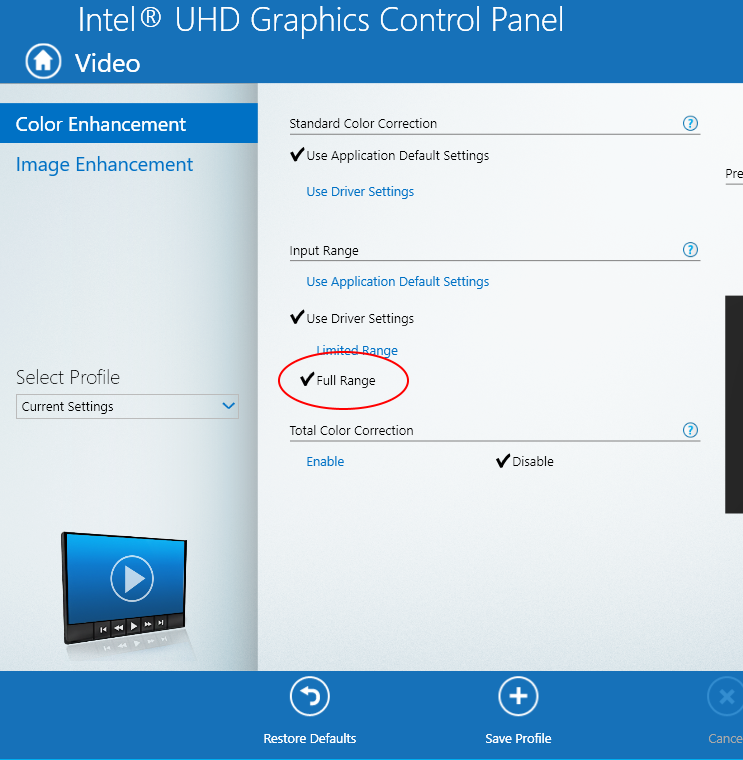

# Troubleshooting case: How to fix washed out colors for your display monitor.

## TL;DR 
If your display monitor looks washed out (i.e. whitish color, or bleached), you can set HDMI color to "Full Range" under Quantization Range.

### Approach 1: Set HDMI "RGB Full" vs. "RGB Limited"
If the display monitor is connected to your laptop or desktop using HDMI cable, then it might be set to "RGB Limited". This happens especially if you are using an external monitor for your laptp

Read [this](https://www.howtogeek.com/285277/how-to-avoid-washed-out-colors-when-using-hdmi-on-your-pc/) for setting RGB range to RGB Full. 
* Intel Graphics
* AMD Graphics
* nVidia Graphics

#### Note
For Intel Graphics, the following setting may not be available.

> Display > General Settings > Advanced and click "Full Range" under Quantization Range. 

Use this instead:

> Video > Color Enhancement > Input Range > Use Driver Settings > Full Range 

### Approach 2: Switch to another version of Win 10
For certain versions of Windows 10, it may not work properly. See: https://answers.microsoft.com/en-us/windows/forum/windows_10-other_settings/colors-washed-out-after-windows-10-creators-update/4ae56588-b0f0-4e5c-a605-ef977214b196

### Approach 3: Change your monitor setting
There are some monitor manufacturers provide such settings as "HDMI Black Level", you may want to try it.

Take [Samsung's setting](https://www.samsung.com/ph/support/tv-audio-video/what-is-the-hdmi-black-level-setting/) for example:
* HDMI Black Level - Low : Sets the HDMI Black Level enhancement for deeper black level range (which looks darker).
* HDMI Black Level - Normal : Sets the HDMI Black Level enhancement for what the device is sending (which looks bleached).
