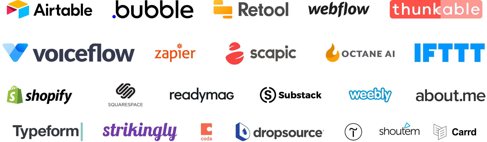

如果你不是程序员，你需要哪些网站？

## 无需编码时代的兴起
Product Hunt的创始人Ryan Hoover，根据自己的经历和见识，认为相比过去，今天的人们在互联网上创造事物变得更容易、所需时间更短，而且不必需要专业的编码知识。

英文原文：
https://medium.com/@rrhoover/the-rise-of-no-code-e733d7c0944d

今天的这些"无需编码"工具，都是基于图形界面，而且功能非常齐全，创建一个漂亮的网站都花不了一个小时。例如下面这些工具：

#### Carrd
 * 创建简单的单页面网站
 * http://carrd.co/

#### Webflow
 * 美观的，响应式的CMS网站
 * https://webflow.com/

#### Shopify
 * 创建电商网站
 * http://shopify.com/

#### Octane AI
 * 创建Facebook Messenger自动问答机器人
 * https://octaneai.com/

#### Voiceflow
 * 创建语音应用程序
 * https://www.getvoiceflow.com/

#### Substack
 * 创建邮件简报或付费订阅
 * https://www.substack.com/

#### Readymag
 * 创建在线杂志
 * https://readymag.com/

#### Scapic
 * 在浏览器中体验AR/VR/3D
 * https://scapic.com/

#### Sheet2Site
 * 将Google表格转换为一个网站
 * https://www.sheet2site.com/

#### Retool
 * 创建内置仪表板和工具
 * https://tryretool.com/

#### Bubble
 * 创建网站App
 * http://bubble.is/

#### Thunkable
 * 创建移动APP
 * https://thunkable.com/

#### Zapier和Airtable
 * 创建复杂一点的网站App
 * http://zapier.com/
 * http://airtable.com/

#### MakerPad,  Zeroqode, NoCode
* 无需编码帮你搞定一切，大小通吃！
* https://www.makerpad.co/
* https://zeroqode.com/

#### Datasette
exploring and publishing data. It helps people take data of any shape or size, analyze and explore it, and publish it as an interactive website and accompanying API.
https://datasette.io/
